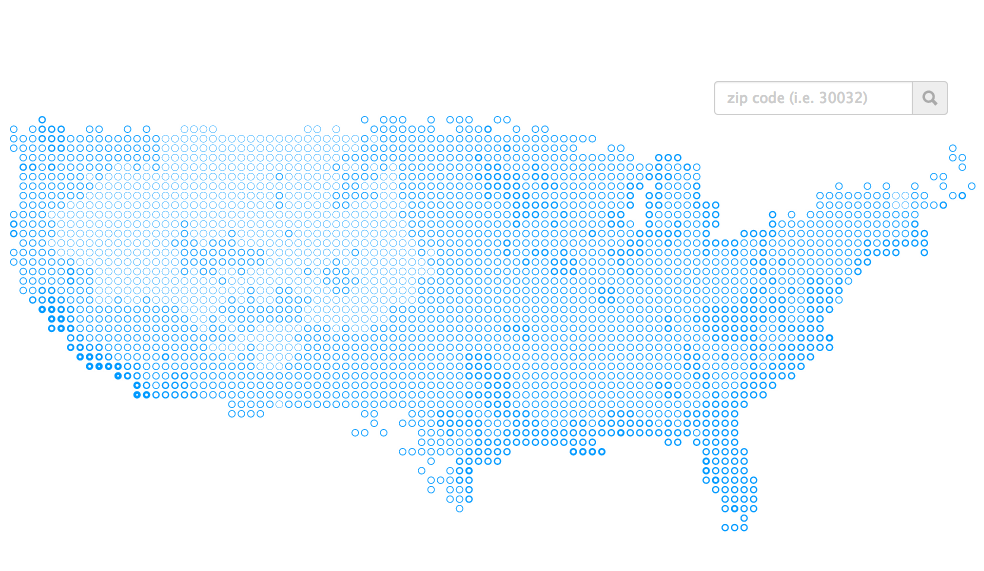

# The Pleasant Places to Live

In Feb 2014, I wrote a [blog post](http://www.kellegous.com/j/2014/02/03/pleasant-places/) that included a visualization
of the number of pleasant days to expect each year in different regions of the continental United States. This is the
source for that project that includes both the data munging code (in Go) and the visualization code (in TypeScript/SCSS).



The original can still be found at [http://www.kellegous.com/j/2014/02/03/pleasant-places/](http://www.kellegous.com/j/2014/02/03/pleasant-places/).

## Requirements

The included Makefile assumes you are on a unix-y system and I have made no attempt to make this work on windows.

* [Go (> 1.0)](http://golang.org/doc/install)
* [node.js (>= 0.8.0)](http://nodejs.org/)
* [TypeScript 0.9.5](http://www.typescriptlang.org/)
* [Sass (3.2.12)](http://sass-lang.com/install)

## Getting Started

The Makefile is intended to bootstrap the project with everything needed to load and develop the visualization. Note that
the first time you run `make`, **A LOT (about 1.8G) of data will be downloaded** from NOAA ftp sites.

```
$ git clone https://github.com/kellegous/pleasant-places.git

$ cd pleasant-places

$ make serve
```

When downloading and building completes, the visualization will be available in your browser at [http://localhost:4020/](http://localhost:4020/).

## Questions

I'm happy to try to answer questions about the code or the project. Feel free to email me at `kellegous@gmail.com`.